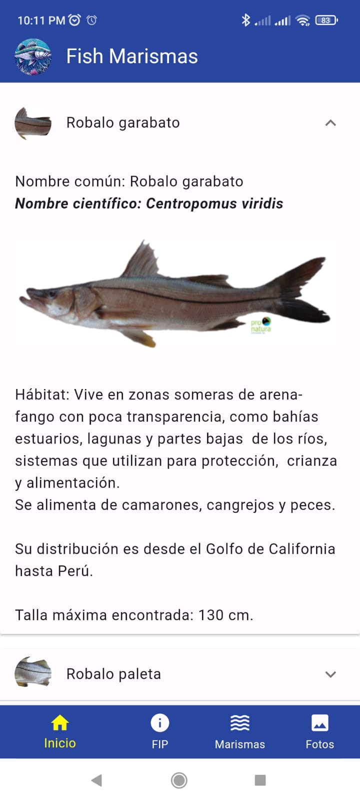
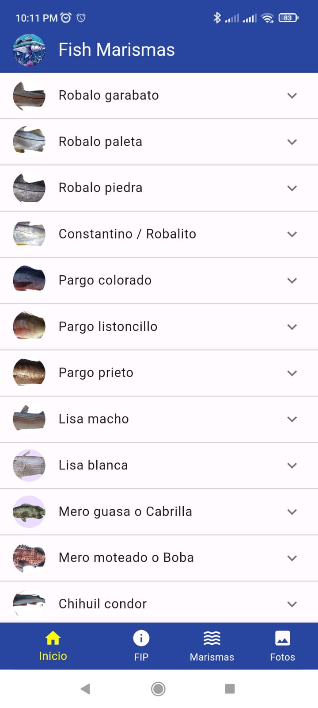
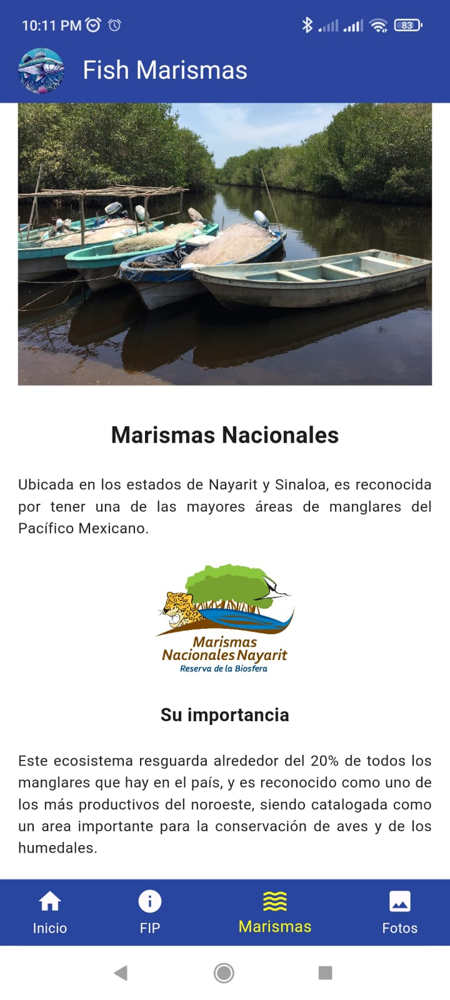
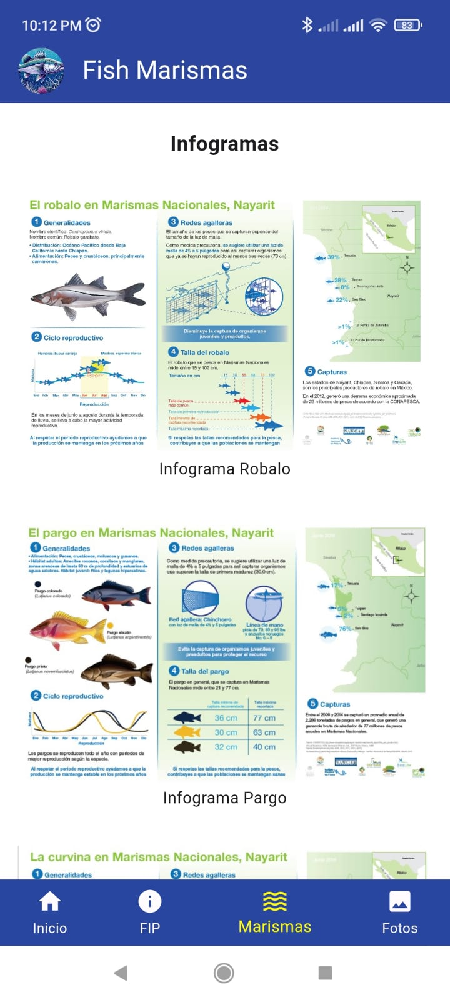
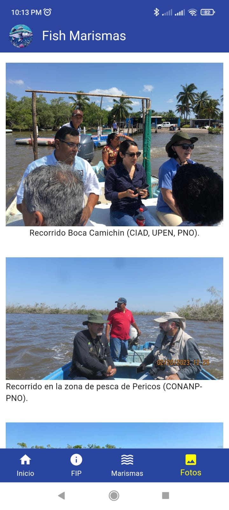

# FishMarismas
### Hola, bienvenido/a a mi Github, la aplicación "FishMarismas" fue creada principalmente para el pescador, donde puede observar las diferentes características taxonómicas de las especies de escama que habitan en las Marismas Nacionales.
### Aquí podrás encontrar imágenes mostrando el funcionamiento de la aplicación en cada una de las pantallas.
---
### Página Principal

---

---
### Marismas Nacionales

---

---
### Anexo Fotográfico

---
### Puedes descargar el APK en el siguiente link: https://drive.google.com/drive/folders/1ZC0YUpp0x9PnoqfNXKs8O2gjEkh8vBZx?usp=sharing
---

